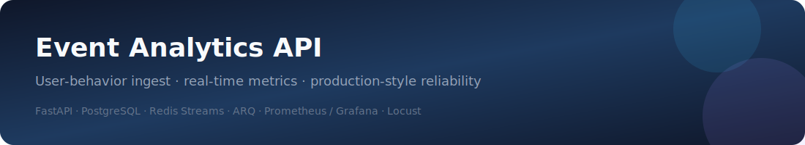
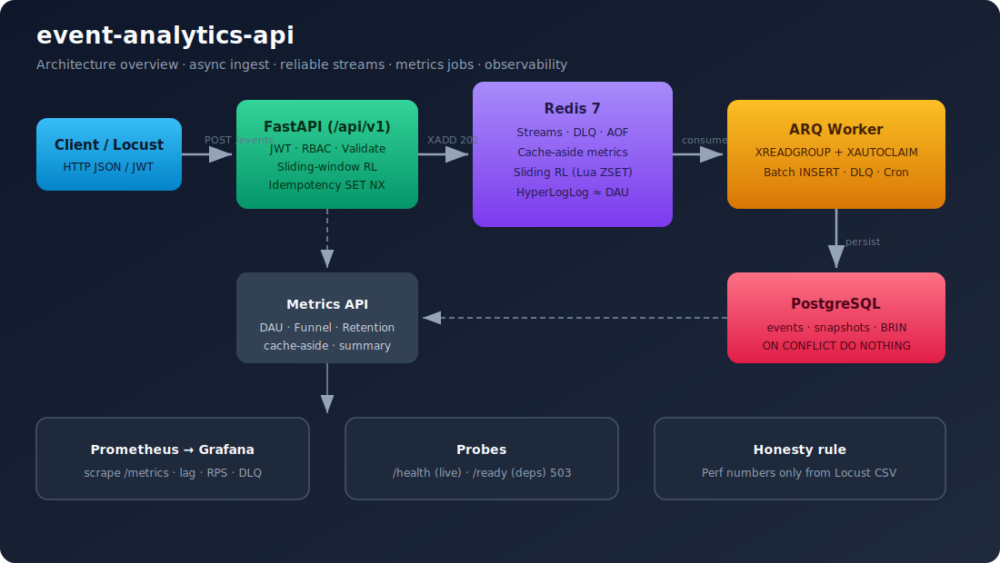
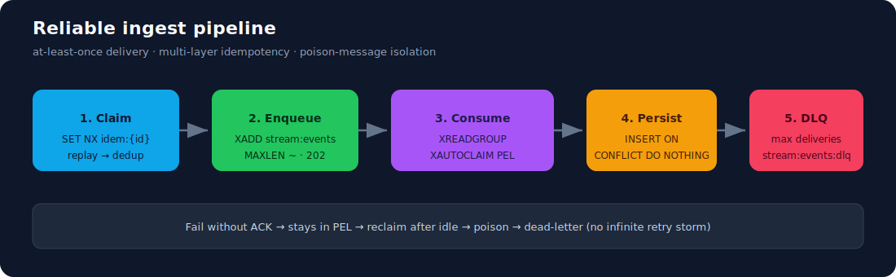

<p align="center">
  
</p>

<h1 align="center">event-analytics-api</h1>

<p align="center">
  <strong>User behavior collection &amp; real-time metrics backend</strong><br/>
  <em>Portfolio-grade FastAPI service — async ingest, reliable streams, metrics jobs, honest load tests</em>
</p>

<p align="center">
  <a href="https://github.com/chenzh659/event-analytics-api/actions/workflows/ci.yml"></a>
  
  
  
  
  
</p>

<p align="center">
  <a href="#-features">Features</a> ·
  <a href="#-architecture">Architecture</a> ·
  <a href="#-quick-start">Quick Start</a> ·
  <a href="#-api-overview">API</a> ·
  <a href="#-testing--load">Testing</a> ·
  <a href="#-project-structure">Structure</a> ·
  <a href="#-design-highlights">Design</a> ·
  <a href="docs/resume-talk-track.md">Interview notes</a>
</p>

---

## ✨ Features

| Area | What you get |
|------|----------------|
| **Event ingest** | `view` / `search` / `add_to_cart` / `order` · single + batch · API versioning `/api/v1` |
| **Auth & RBAC** | JWT (HS256) · roles `admin` / `analyst` / `client_app` · permission checks |
| **Idempotency** | Client `event_id` + Redis `SET NX` + DB `UNIQUE` + `ON CONFLICT DO NOTHING` |
| **Async pipeline** | Redis Streams → ARQ worker · optional sync mode via `INGEST_MODE` |
| **Reliability** | **XAUTOCLAIM** reclaim · **DLQ** for poison messages · stream `MAXLEN` |
| **Metrics jobs** | DAU · funnel · D1/D7 retention · advisory locks · Redis cache-aside |
| **Approx realtime DAU** | HyperLogLog on write path (O(1) memory) |
| **Rate limit** | Sliding window · Lua ZSET · IP / user / event-write quotas |
| **Observability** | structlog JSON · `X-Request-ID` · Prometheus · Grafana · path-label normalization |
| **Ops probes** | `/health` liveness · `/ready` readiness (**503** when deps down) |
| **Data layer** | SQLAlchemy 2 async · Alembic · **BRIN** on `server_ts` · partial indexes |
| **Hardening** | Optimistic lock on users · body size cap · security headers |
| **Honest perf** | Locust → CSV → `write_perf_report.py` · **no fabricated p95/RPS** |

---

## 🏗 Architecture

<p align="center">
  
</p>

### Reliable ingest path

<p align="center">
  
</p>

<details>
<summary><strong>Text diagram (copy-friendly)</strong></summary>

```text
Client / Locust
    │  JWT + RBAC + sliding-window RL
    ▼
FastAPI  ──SET NX──► Redis idem keys
    │ XADD (async) / INSERT (sync)
    ▼
stream:events  ──►  ARQ worker
    │                 ├─ XREADGROUP
    │                 ├─ XAUTOCLAIM (stuck PEL)
    │                 ├─ INSERT ON CONFLICT DO NOTHING
    │                 ├─ PFADD hll:dau
    │                 └─ poison → stream:events:dlq
    ▼
PostgreSQL (events, metrics_*, users)
    ▲
Metrics API ◄── cache-aside Redis
Prometheus  ◄── /metrics ──► Grafana
```

</details>

More detail: [docs/architecture.md](docs/architecture.md)

---

## 🚀 Quick Start

### Prerequisites

- [Docker Desktop](https://www.docker.com/products/docker-desktop/) / Docker Compose v2
- (Optional) Python 3.12 for local tooling

### One command

```bash
git clone https://github.com/chenzh659/event-analytics-api.git
cd event-analytics-api

cp .env.example .env          # Windows: copy .env.example .env
docker compose up -d --build
```

Wait until `api` is healthy, then:

```bash
curl http://localhost:8001/health
# {"status":"ok","service":"event-analytics-api","version":"1.0.0"}
```

| Surface | URL |
|---------|-----|
| Swagger UI | http://localhost:8001/docs |
| ReDoc | http://localhost:8001/redoc |
| Prometheus | http://localhost:9090 |
| Grafana | http://localhost:3001 (`admin` / `admin`) |

> **Port map** (avoids clashing with other local stacks): API **8001**, Postgres **5433**, Redis **6380**, Grafana **3001**.

### Seed accounts

| Role | Email | Password |
|------|-------|----------|
| admin | `admin@example.com` | `Admin123!` |
| analyst | `analyst@example.com` | `Analyst123!` |
| client_app | `client@example.com` | `Client123!` |

---

## 🎬 15-minute demo

```bash
# 1) Login as client
TOKEN=$(curl -s -X POST http://localhost:8001/api/v1/auth/login \
  -H 'Content-Type: application/json' \
  -d '{"email":"client@example.com","password":"Client123!"}' | jq -r .access_token)

# 2) Ingest an event
EVENT_ID=$(python -c "import uuid; print(uuid.uuid4())")
curl -s -X POST http://localhost:8001/api/v1/events \
  -H "Authorization: Bearer $TOKEN" \
  -H 'Content-Type: application/json' \
  -d "{\"event_id\":\"$EVENT_ID\",\"session_id\":\"demo-1\",\"event_type\":\"view\",\"properties\":{\"page\":\"/home\"}}"

# 3) Replay → deduplicated: true
curl -s -X POST http://localhost:8001/api/v1/events \
  -H "Authorization: Bearer $TOKEN" \
  -H 'Content-Type: application/json' \
  -d "{\"event_id\":\"$EVENT_ID\",\"session_id\":\"demo-1\",\"event_type\":\"view\",\"properties\":{\"page\":\"/home\"}}"

# 4) Worker consumption
docker compose logs worker --tail=50

# 5) Metrics as analyst
ANALYST=$(curl -s -X POST http://localhost:8001/api/v1/auth/login \
  -H 'Content-Type: application/json' \
  -d '{"email":"analyst@example.com","password":"Analyst123!"}' | jq -r .access_token)

curl -s http://localhost:8001/api/v1/metrics/dau -H "Authorization: Bearer $ANALYST"
curl -s http://localhost:8001/api/v1/metrics/funnel -H "Authorization: Bearer $ANALYST"
curl -s http://localhost:8001/api/v1/admin/queue \
  -H "Authorization: Bearer $(curl -s -X POST http://localhost:8001/api/v1/auth/login \
    -H 'Content-Type: application/json' \
    -d '{"email":"admin@example.com","password":"Admin123!"}' | jq -r .access_token)"
```

Windows PowerShell: use `Invoke-RestMethod` instead of `curl` / `jq`.

---

## 📡 API Overview

| Method | Path | Auth |
|--------|------|------|
| `POST` | `/api/v1/auth/register` | public |
| `POST` | `/api/v1/auth/login` | public |
| `GET` | `/api/v1/auth/me` | authenticated |
| `POST` | `/api/v1/events` | `events:write` |
| `POST` | `/api/v1/events/batch` | `events:batch` |
| `GET` | `/api/v1/events/{event_id}` | `events:read` |
| `GET` | `/api/v1/metrics/dau` | `metrics:read` |
| `GET` | `/api/v1/metrics/funnel` | `metrics:read` |
| `GET` | `/api/v1/metrics/retention` | `metrics:read` |
| `GET` | `/api/v1/metrics/realtime/events-per-minute` | `metrics:read` |
| `GET` | `/api/v1/metrics/summary` | `metrics:read` |
| `GET` | `/api/v1/admin/users` | `users:manage` |
| `PATCH` | `/api/v1/admin/users/{id}` | `users:manage` (+ optimistic `version`) |
| `GET` | `/api/v1/admin/queue` | `queue:read` |
| `POST` | `/api/v1/admin/jobs/{job_name}` | `jobs:trigger` |
| `GET` | `/health` · `/ready` · `/metrics` | public / ops |

**Error envelope**

```json
{
  "error": {
    "code": "forbidden",
    "message": "Missing permission: metrics:read",
    "request_id": "…"
  }
}
```

Interactive docs: **http://localhost:8001/docs** after `compose up`.

---

## ⚙️ Configuration

See [`.env.example`](.env.example). Highlights:

| Variable | Meaning |
|----------|---------|
| `INGEST_MODE` | `async` (Streams) or `sync` (request-path write) |
| `RATE_LIMIT_*` | Sliding-window quotas (IP / user / events) |
| `EVENT_CLAIM_MIN_IDLE_MS` | PEL reclaim threshold for `XAUTOCLAIM` |
| `EVENT_MAX_DELIVERIES` | Poison threshold → DLQ |
| `CACHE_TTL_*` | Metrics cache TTLs |
| `JWT_SECRET` | **Change in any shared environment** |

---

## 🧪 Testing & Load

```bash
# Unit + ASGI health (no external deps required for pure unit)
docker compose exec api pytest tests/unit tests/integration/test_health.py -q

# HTTP integration against live stack (from inside Compose network)
docker compose exec -e RUN_INTEGRATION=1 -e API_BASE_URL=http://api:8000 api \
  pytest tests/integration/test_api_flow.py -q
```

### Performance report (real numbers only)

```bash
mkdir -p results

# Example: 50 users, 5 minutes (adjust for your machine)
docker compose exec api locust -f tests/load/locustfile.py \
  --host http://api:8000 \
  --headless -u 50 -r 10 -t 5m --csv=results/run1

docker compose exec api python scripts/write_perf_report.py \
  --csv results/run1_stats.csv \
  --users 50 \
  --duration 5m \
  --out docs/performance-report.md
```

Template: [docs/performance-report.md](docs/performance-report.md) — placeholders until Locust is run.

Optional historical data (funnel / retention demos):

```bash
docker compose exec api python -m scripts.generate_load_data \
  --days 14 --users 200 --events-per-day 500
```

Slow-query helpers (`pg_stat_statements`):

```bash
docker compose exec -T postgres psql -U events -d events < scripts/analyze_slow_queries.sql
```

---

## 📁 Project structure

```text
event-analytics-api/
├── app/
│   ├── api/v1/           # versioned routes (auth, events, metrics, admin)
│   ├── core/             # security, RBAC, exceptions, RL, middleware
│   ├── db/models/        # SQLAlchemy models
│   ├── services/         # business logic
│   ├── mq/               # Redis Streams (produce / reclaim / DLQ)
│   ├── workers/          # ARQ settings + jobs
│   └── observability/    # Prometheus metrics
├── alembic/              # migrations (incl. BRIN)
├── scripts/              # seed, load data, perf report, entrypoints
├── tests/                # unit · integration · load (Locust)
├── monitoring/           # Prometheus + Grafana provisioning
├── docs/
│   ├── assets/           # README diagrams (SVG)
│   ├── architecture.md
│   ├── performance-report.md
│   └── resume-talk-track.md
├── docker-compose.yml
└── .github/workflows/ci.yml
```

---

## 💡 Design highlights

1. **Multi-layer idempotency** — client UUID + Redis NX + DB unique + upsert-safe insert.  
2. **Decoupled write path** — API returns **202** quickly; worker batches to Postgres.  
3. **Stream reliability** — `XAUTOCLAIM` for stuck PEL; max-delivery **DLQ** (`stream:events:dlq`).  
4. **Sliding-window rate limit** — atomic Redis Lua / ZSET (less boundary burst than fixed windows).  
5. **Metric jobs** — `pg_advisory_xact_lock`, snapshot tables, cache-aside, optional HLL.  
6. **Time-series indexes** — BRIN(`server_ts`) + partial indexes for user-active scans.  
7. **Optimistic concurrency** — `PATCH /admin/users` with `version` → **409** on conflict.  
8. **Cardinality-safe metrics** — path UUIDs normalized to `{id}` before Prometheus labels.  
9. **Probe split** — liveness never depends on Redis/PG; readiness does.  
10. **Honest load testing** — report generator only accepts measured Locust CSV.

Interview bullets & Q&A: [docs/resume-talk-track.md](docs/resume-talk-track.md)

---

## 🛠 Tech stack

| Layer | Choice |
|-------|--------|
| API | Python 3.12 · FastAPI · Uvicorn |
| DB | PostgreSQL · SQLAlchemy 2 async · Alembic · asyncpg |
| Cache / MQ / Jobs | Redis 7 Streams · ARQ |
| Auth | JWT HS256 · bcrypt · RBAC |
| Observability | structlog · prometheus-client · Grafana |
| Load | Locust |
| Packaging | Docker Compose · GitHub Actions CI |

---

## 🗺 Roadmap (optional)

- [ ] Multi-consumer horizontal scale demo  
- [ ] OpenTelemetry traces  
- [ ] Partitioned `events` table for multi-month retention  
- [ ] Publish measured Locust report after CI-friendly load job  

---

## 📄 License

[MIT](LICENSE) © 2026 [chenzh659](https://github.com/chenzh659)

---

<p align="center">
  <sub>Built as a portfolio backend — production patterns, honest numbers, interview-ready design notes.</sub>
</p>
